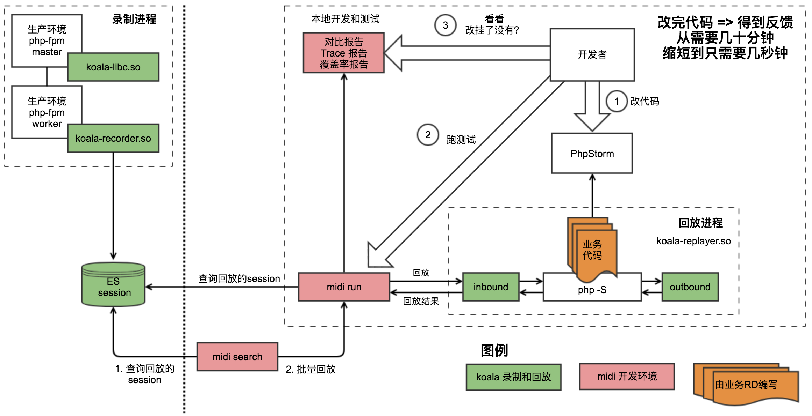
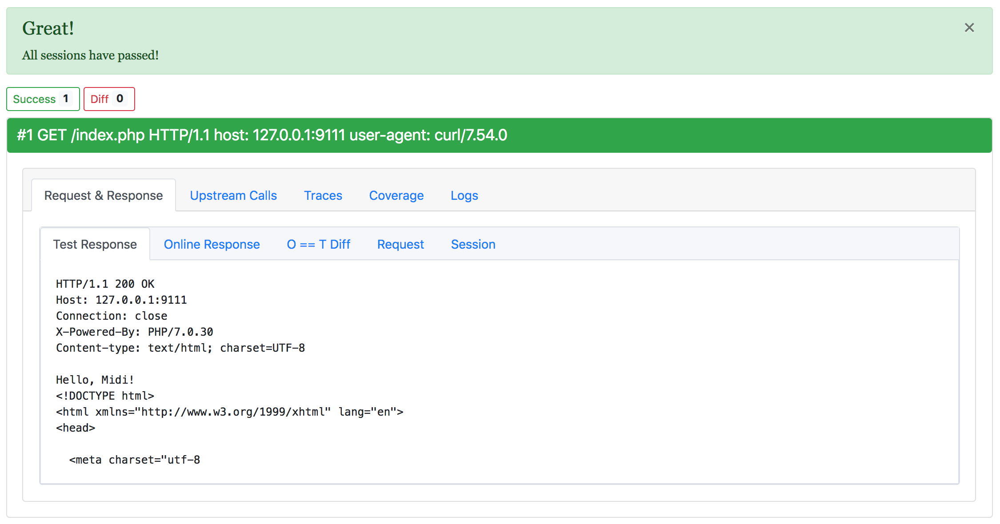
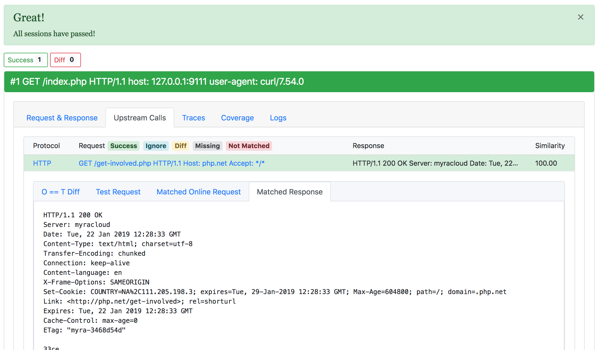
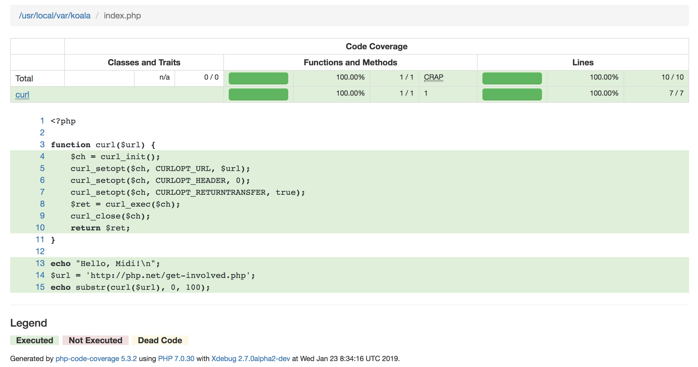

<h1 align="center">RDebug - Real Debugger</h1>

[](https://gitter.im/didi/rdebug?utm_source=badge&utm_medium=badge&utm_campaign=pr-badge)
[](https://github.com/didi/rdebug/blob/master/LICENSE)

## Translation

- [中文](./README_zh_CN.md)

## 1. Introduction

Rdebug is an open source *tool chain* that focusing on efficiency of daily developing, testing and debugging for developers. The code will be robust.

### 1.1 Background

As micro-service architecture makes services *isomerous*, *easy-to-deploy* and *superbly extensible*, large systems are divided into several micro services.

But, micro-service architecture is not a silver bullet. It has several drawbacks. One service is divided into several small services, test environment becomes hard to maintain. Unit test needs to mock downstream services. This will downgrade the efficiency of developing, and increase production bugs.

We do believe this industry needs an evolution.

### 1.2 Principle

Efficiency improvement, release cycle reduction, code quality improvement, production bug reduction

### 1.3 When to use

Suitable for old api refactoring that traffic have already been recorded.

Not suitable for new api or api that has no traffic recorded.

Support for new api is under investigation.

## 2. Quick Started

### Traffic Recording

```shell
# Start php-fpm with koala-libc.so & koala-recorder.so
# Compile koala-libc.so & koala-recorder.so first

# Environment
$ export KOALA_SO=/path/to/koala-recorder.so 
$ export KOALA_RECORD_TO_DIR=/path/to/your-save-recorded-session-dir
$ export LC_CTYPE="C"

# macOS
$ DYLD_INSERT_LIBRARIES="/path/to/koala-libc.so:/usr/lib/libcurl.dylib" DYLD_FORCE_FLAT_NAMESPACE="y" /path/to/sbin/php-fpm

# or, Linux
$ LD_PRELOAD="/path/to/koala-libc.so /usr/lib64/libcurl.so.4" /path/to/sbin/php-fpm
```

### Traffic Replaying

Three ways to replay: replay from source, replay by midi.phar, replay by composer vendor/bin.

```shell
# Source
$ git clone https://github.com/didi/rdebug.git
$ cd rdebug/php/midi
$ sh install.sh
$ cd /path/to/your/project
$ /path/to/rdebug/php/midi/bin/midi run -f RECORD-SESSION-FILE

# Or, Phar
$ wget -O midi.phar -q https://github.com/didi/rdebug/raw/master/output/bin/midi.phar
$ midi.phar run -f RECORD-SESSION-FILE

# Or, Composer
$ cd /path/to/your/project
$ composer require rdebug/midi --dev
$ ./vendor/bin/midi run -f RECORD-SESSION-FILE
```

### PHP Example

- [PHP Record & Replay Example](./example/php/README.md)
- [Replay Local File](./doc/midi/Replay-file.md)

## 3. Technical Details

We are using real production traffic to test on non-production environment. So, the core features of `Rdebug` are traffic recording and traffic replaying.

* **Traffic Recording**

  Recording production traffic, including RPC between micro-services. The most difficult part is to trace requests that will span multiple services.

* **Traffic Replaying**

  Replaying recorded production traffic against non-production environment, mock downstream traffic based on traffic matching. The most difficult part is interception and traffic matching.



### 3.1 Koala & Koala-libc

Koala and Koala-libc is the engine of Rdebug.

Because the problems such as *RPC tracing*, *libc interception* that a traffic replaying system may concern is what a traffic recording system concerns. The traffic recording and replaying system shares the same engine.

#### Koala

Koala is written in Go, libc contains some c++ code for interception part which will complied to *koala-recorder.so* and *koala-replayer.so*

Koala support replaying and recording separately as well as simultaneously.

For more details: [koala](./koala/README.md) 。

#### Koala-libc

koala-libc is written in C, and compiled to *koala-libc.so*

Go does not support `fork`. To avoid problems bring by PHP-FPM fork worker, you need to inject *koala-libc.so* into parent process of PHP. So that *koala-libc.so* will forward requests libc intercepted to *koala-recorder.so when `accept` in child process

For more details: [koala-libc](./koala-libc/README.md) 。

### 3.2 Midi

Midi is a traffic replay client for PHP using command line written in PHP.

*koala-replayer.so* is embedded in Midi, and it can replay production traffic against new code, analyze test result, generate diff report, trace report, coverage report.

Midi support Xdebug.

For more details: [midi](./php/midi/README.md) 。

## 4. Compile

### 4.1 Requirement

#### Koala & Koala-libc

- GCC >= 4.8
- Go >= 1.8
- Glide

#### Midi

- macOS (linux support is coming soon)
- PHP >= 7.0
- Xdebug

### 4.2 Compile Koala-libc

```shell
$ cd koala-libc
$ sh build.sh
```

will generate `../output/libs/koala-libc.so`。

### 4.3 Compile Koala

```shell
$ cd koala

# install depends
$ sh build.sh vendor

# koala-recorder.so
$ sh build.sh recorder

# koala-replayer.so
$ sh build.sh
```

will generate `../output/libs/koala-recorder.so` and `../output/libs/koala-replayer.so`。

### 4.4 Compile midi.phar

Before compile midi.pahr, recommend compile `koala-replayer.so` at your system and store in `php/midi/res/replayer` directory.

`php/midi/res/replayer/koala-replayer.so` in repository is for macOS.

```shell
$ cd php/midi
$ sh build.sh
```

will generate `../output/bin/midi.phar`

Default phar will not include `DiPlugin` plugin, which is an internal plugin of didi.

If your want to compile with `DiPlugin` plugin:

```
$ cd php/midi
$ sh build.sh midi-diplugin
```

## 5. Usage

### 5.1 Traffic Recording

Record traffic in file or Elastic.

Set environment variable `KOALA_RECORD_TO_DIR` to save record to specified dir

Inject so. Use `DYLD_INSERT_LIBRARIES` in macOs or `LD_PRELOAD` in Linux

For more details: [Recorder](./doc/recorder/recorder.md)。

#### 5.1.1 macOS Recording

```shell
$ DYLD_INSERT_LIBRARIES="/path/to/koala-libc.so:/usr/lib/libcurl.dylib" DYLD_FORCE_FLAT_NAMESPACE="y" LC_CTYPE="C" KOALA_SO=/path/to/koala-recorder.so KOALA_RECORD_TO_DIR=/tmp /usr/local/sbin/php-fpm
```

#### 5.1.2 Linux Recording

```shell
LD_PRELOAD="/path/to/koala-libc.so /usr/lib64/libcurl.so.4" LC_CTYPE="C" KOALA_SO="/path/to/koala-recorder.so" KOALA_RECORD_TO_DIR=/tmp /usr/local/sbin/php-fpm
```

Koala support writing to Elastic by replacing `KOALA_RECORD_TO_DIR` with `KOALA_RECORD_TO_ES` which value is elastic write url

### 5.2 Traffic Replay

Traffic replaying is to replay recorded traffic in production against non-production environment. You need only to deploy your code w/o deploying downstream services.

Below is a simple example of replaying with '-f', which specified the file to replay.

#### 5.2.1 Replay

```Shell
# Source
$ /path/to/rdebug/php/midi/bin/midi run -f RECORD-SESSION-FILE

# Or, phar
$ midi.phar run -f RECORD-SESSION-FILE

# Or, composer vendor bin
$ ./vendor/bin/midi -f RECORD-SESSION-FILE
```

For more details: [Replay](#traffic-replaying)

Use -v, -vv or -vvv for more verbose log.

#### 5.2.2 Report

Use `-R`，`-T`，`-C` to generate：Replay report, Trace report, Coverage report







For more details: [Midi](./php/midi/README.md)。

## 6. More

### 6.1 Translation

* [中文](./README_zh_CN.md)

### 6.2 Documentation

* [Documentation](./doc/DocList.md)
* [Wiki](https://github.com/didi/rdebug/wiki)

### 6.3 Contribute

Any contributions are welcome. [More Details](./CONTRIBUTING.md)

### 6.4 Contract

- QQ Group
    


### 6.5 License

Rdebug is licensed under the Apache 2.0 License. [LICENSE](./LICENSE)

### 6.6 Thanks

[TaoWen](https://github.com/taowen) Developer of Koala & Koala-libc

[TanMingliang](https://github.com/TopN), WangBizhou, FangJunda, YangJing, YangBochen and LiXiaodong Developer of Midi

A special thanks to Symfony、Xdebug、PHPUnit & Code Coverage、guzzlehttp…… contributors, develop such a useful software.

Also thanks to DingWei Wujun, FanYitian, ZhaoLu, XuKaiwen, HuXu, FuYao and HuMin for suggestions.
