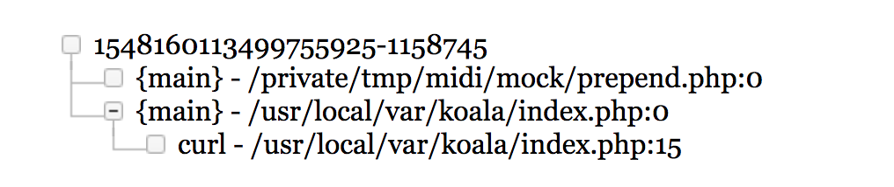
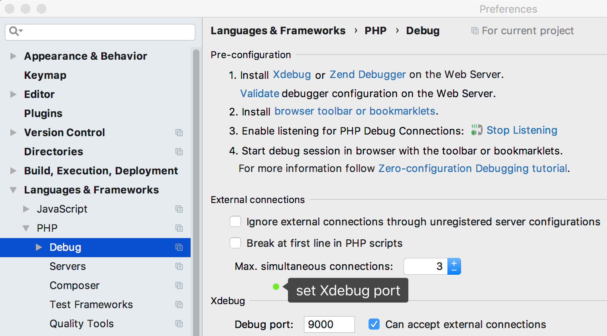
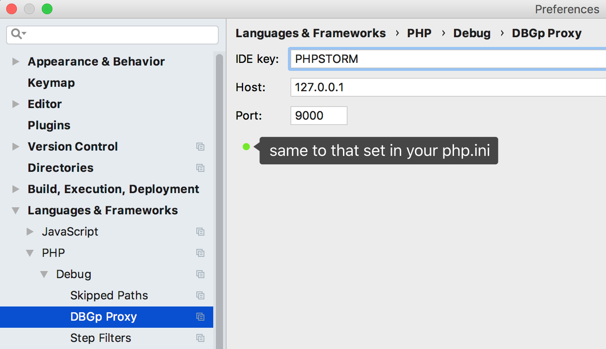
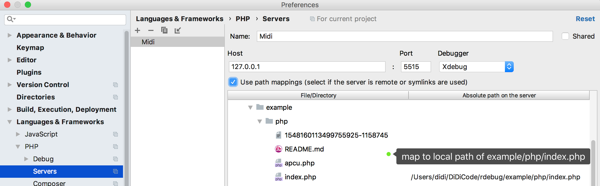
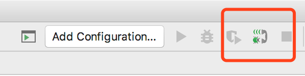
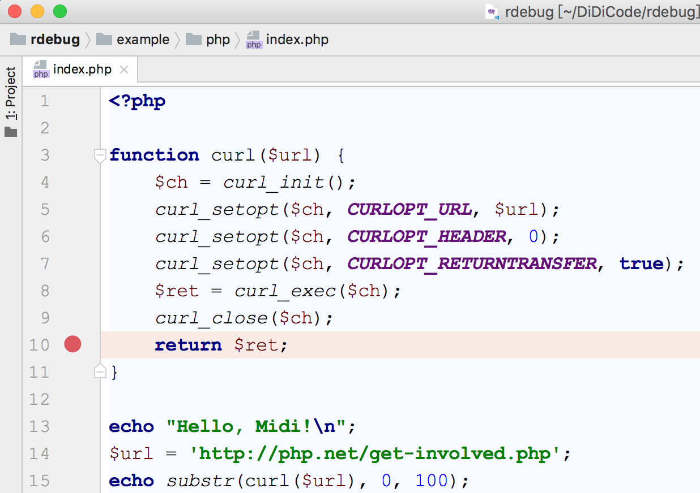
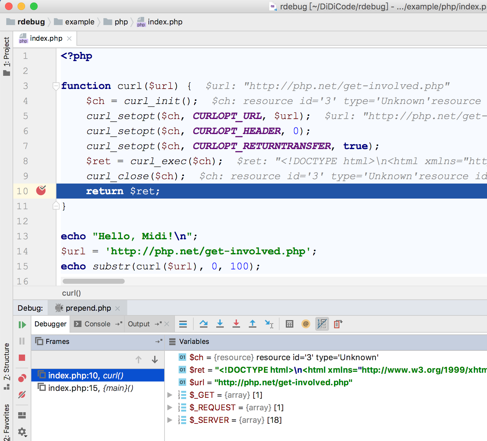

# Record Traffic & Replay

Example code and config at [example/php](https://github.com/didi/rdebug/tree/master/example/php) directory.

This example needs nginx & php-fpm, you should install first.

## Nginx Config

[nginx.conf](https://github.com/didi/rdebug/blob/master/example/php/nginx.conf)

Webroot at `/usr/local/var/koala` and listen port `9111`.

PHP request will pass to `/usr/local/var/run/php-fpm.sock`.

```
worker_processes auto;

events {
    worker_connections 1024;
}

worker_rlimit_nofile 51200;

http {
    include       mime.types;
    default_type  application/octet-stream;
    charset utf-8;

    sendfile       on;
    tcp_nopush     on;

    server {
        listen       9111;
        server_name  localhost;

        root /usr/local/var/koala;

        location / {
            index index.php index.html index.htm;
        }

        location ~ \.php$ {
            fastcgi_pass   unix:/usr/local/var/run/php-fpm.sock;

            fastcgi_split_path_info ^(.+\.php)(/.*)$;
            fastcgi_param SCRIPT_FILENAME $realpath_root$fastcgi_script_name;
            fastcgi_param DOCUMENT_ROOT $realpath_root;

            include        fastcgi_params;
        }
    }
}
```
## php-fpm Config

Modify php-fpm config and set `clear_env` to `no`:

```
clear_env = no
```

## index.php

Service entry point at [`/usr/local/var/koala/index.php`](https://github.com/didi/rdebug/blob/master/example/php/index.php):

```php
<?php

function curl($url) {
    $ch = curl_init();
    curl_setopt($ch, CURLOPT_URL, $url);
    curl_setopt($ch, CURLOPT_HEADER, 0);
    curl_setopt($ch, CURLOPT_RETURNTRANSFER, true);
    $ret = curl_exec($ch);
    curl_close($ch);
    return $ret;
}

echo "Hello, Midi!\n";
$url = 'http://php.net/get-involved.php';
echo substr(curl($url), 0, 100);

```

Example code just curl `http://php.net/get-involved.php`.

## Compile `koala-libc.so` & `koala-recorder.so`

- [Compile koala-libc.so](https://github.com/didi/rdebug#42-compile-koala-libc)
- [Compile koala-recorder.so](https://github.com/didi/rdebug#43-compile-koala)

If you don't want to compile and record, this example also provide a recorded session [1548160113499755925-1158745](./1548160113499755925-1158745), you could go to [replay session](#replay-session).

## Start Service

```
# Start Nginx
$ nginx -c /path/to/nginx.conf

# Copy koala-libc.so & koala-recorder.so to /usr/local/var/koala
$ cp /path/to/koala-libc.so /usr/local/var/koala
$ cp /path/to/koala-recorder.so /usr/local/var/koala 

# Start php-fpm with koala-libc.so & koala-recorder.so (Inject *.so to php-fpm)
# macOS
$ DYLD_INSERT_LIBRARIES="/usr/local/var/koala/koala-libc.so:/usr/lib/libcurl.dylib" DYLD_FORCE_FLAT_NAMESPACE="y" LC_CTYPE="C" KOALA_SO=/usr/local/var/koala/koala-recorder.so KOALA_RECORD_TO_DIR=/usr/local/var/koala /usr/local/sbin/php-fpm
# or, Linux
$ LD_PRELOAD="/usr/local/var/koala/koala-libc.so /usr/lib64/libcurl.so.4" LC_CTYPE="C" KOALA_SO=/usr/local/var/koala/koala-recorder.so KOALA_RECORD_TO_DIR=/usr/local/var/koala /usr/local/sbin/php-fpm
```

Use `DYLD_INSERT_LIBRARIES` or `LD_PRELOAD` inject `koala-libc.so` to php-fpm as a loader, which will load `koala-recorder.so` to php-fpm worker.

Example use `KOALA_RECORD_TO_DIR` env to save recorded traffic to `/usr/local/var/koala` directory.

Recorder support protocol: 

- HTTP
- MySQL
- Thrift
- Redis
- Apcu（Apcu need add a uploader see [demo](./apcu.php)）。

## Access index.php

```
$ cd /usr/local/var/koala
$ ls
index.php         koala-libc.so     koala-recorder.so

$ curl 127.0.0.1:9111/index.php
Hello, Midi!
<!DOCTYPE html>
<html xmlns="http://www.w3.org/1999/xhtml" lang="en">
<head>

  <meta charset="utf-8
$ ls
index.php        koala-libc.so     koala-recorder.so
```

After first access, we can not find any record session.
 
Because session was separated by request begin message (FCGI_BEGIN_REQUEST prefix is [`11`](https://github.com/didi/rdebug/blob/master/koala/cmd/recorder/main.go#L31)).

When php-fpm get next request, recorder.so will finish last session and save to file.

So, we could continue access index.php and get last session:

```
$ curl 127.0.0.1:9111/index.php
Hello, Midi!
<!DOCTYPE html>
<html xmlns="http://www.w3.org/1999/xhtml" lang="en">
<head>

  <meta charset="utf-8
$ ls
1548160113499755925-1158745    index.php        koala-libc.so               koala-recorder.so
```

So we got the first recorded session: [1548160113499755925-1158745](./1548160113499755925-1158745).

## Replay Session

```
$ /path/to/rdebug/php/midi/bin/midi run -f 1548160113499755925-1158745 -ORT

# or
$ midi.phar run -f 1548160113499755925-1158745 -ORT
```

### Replay Options

```
-R generate replay report
-T generate xdebug trace report
-C generate code coverage report
```

Use `midi run -h` to see more options.

### Replayed Report

- Replay Report


- Upstream Calls


- Code Coverage

Add `-C` options, which will generate code coverage report.

You should add phpunit.xml.dist at your project directory, here is a example [phpunit.xml.dist](./phpunit.xml.dist)


- Xdebug Traces



### Replay With Xdebug

- php.ini

```
zend_extension="xdebug.so"
xdebug.remote_enable=1
xdebug.remote_host="127.0.0.1"
xdebug.remote_port="9000"
xdebug.idekey="PHPSTORM"

xdebug.default_enable = On
xdebug.auto_trace=Off
xdebug.collect_params=Off
xdebug.collect_return=Off

xdebug.trace_output_dir=/tmp/midi/trace
```

- PHPStorm
 










Use `-x` option to replay with xdebug:

```
/path/to/rdebug/php/midi/bin/midi run -f 1548160113499755925-1158745 -x
```




## FAQ

### 1. Replay At Different Directory

Let us suppose your online service deploy at `/usr/local/var/koala`.

But, your mac local code at `/Users/didi/offline`.

```
$ ls /Users/didi/offline
1548160113499755925-1158745 index.php
```

Just add a config at `/Users/didi/offline/.midi/config.yml`:

```
redirect-dir:
    /usr/local/var/koala: /Users/didi/offline
```

Replay:

```
$ /path/to/rdebug/php/midi/bin/midi run -f 1548073294845473414-6556170 -ORT

# or
$ midi.phar run -f 1548073294845473414-6556170 -ORT
```

Config [Documentation](https://github.com/didi/rdebug/blob/master/doc/midi/Config-en-US.md) / [中文文档](https://github.com/didi/rdebug/blob/master/doc/midi/Config.md).

### 2. How to check inject works

```
# Check fpm master, will get koala-libc.so
$ lsof -p php-fpm-master-PID | grep koala

# Check php-worker after request, will koala-libc.so & koala-recorder.so
$ lsof -p php-fpm-worker-PID | grep koala
```

