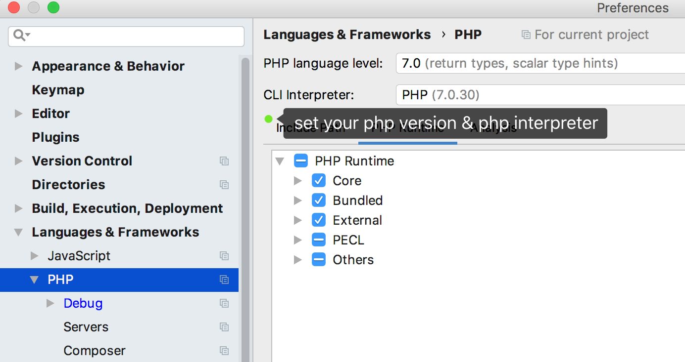
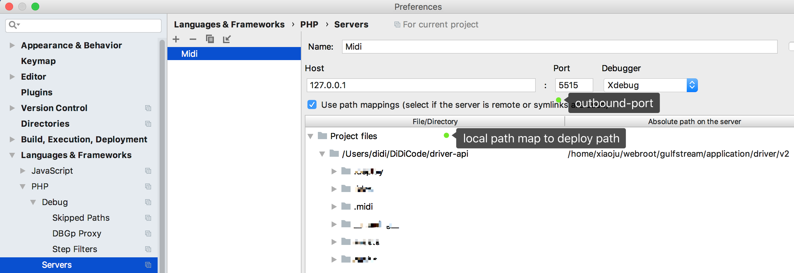
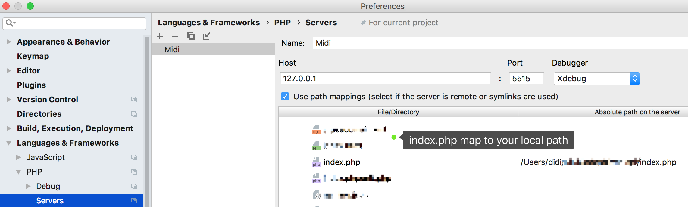
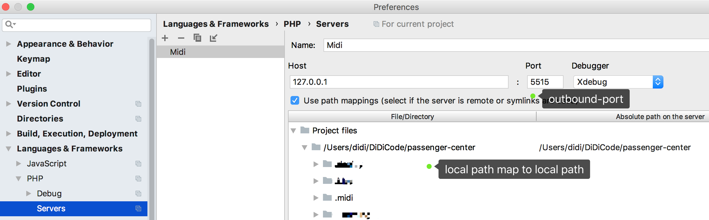
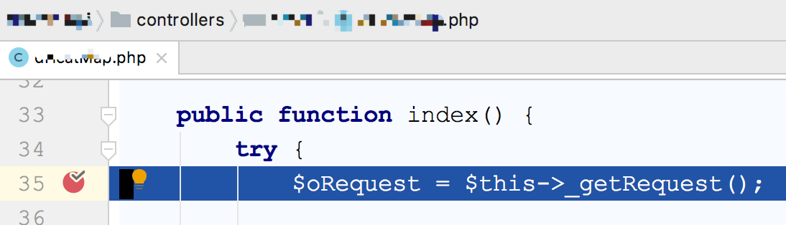
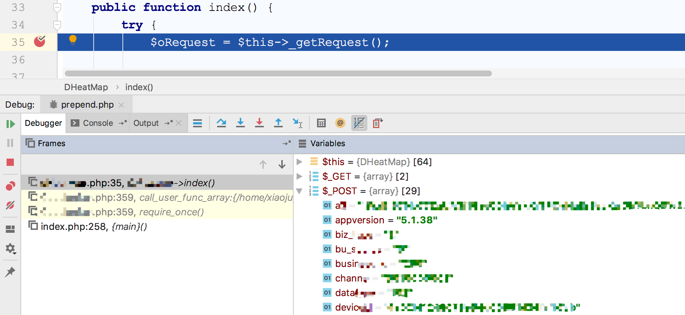
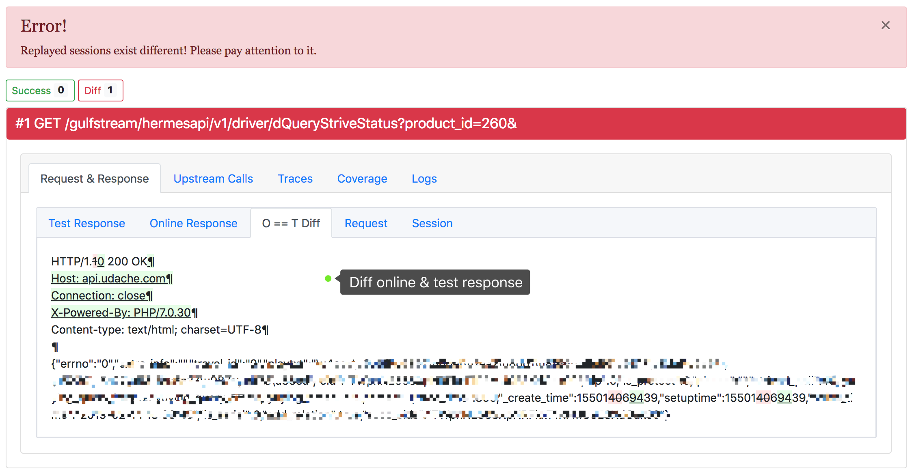
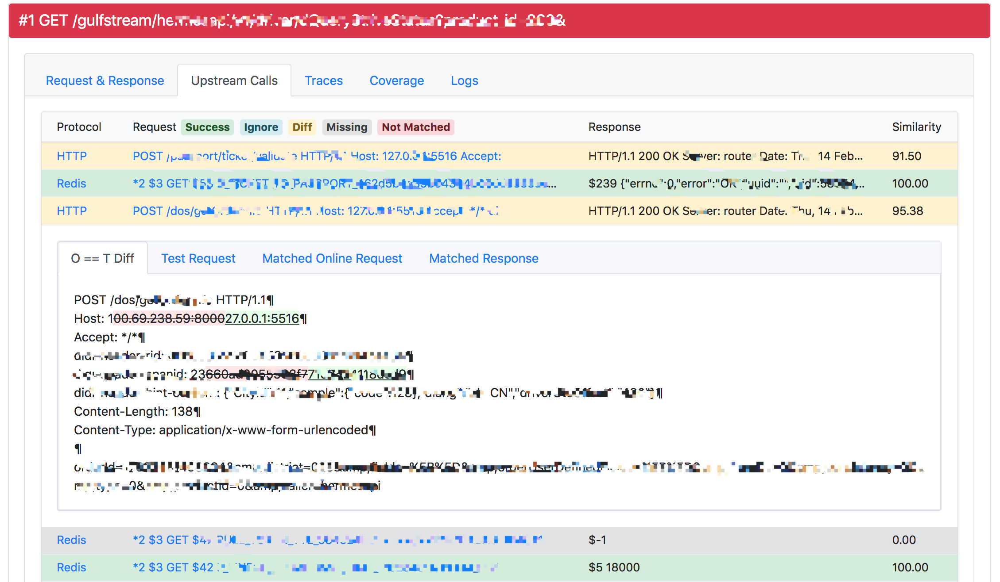
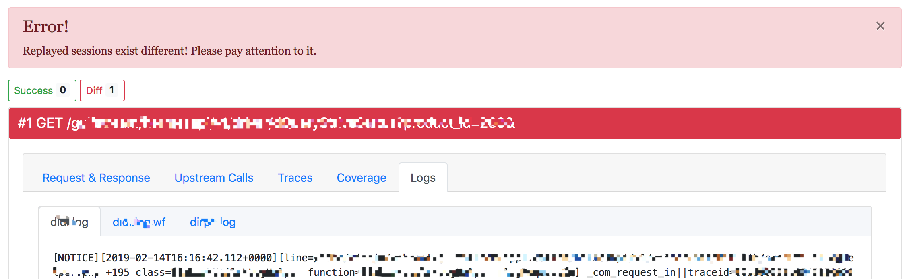

# Midi

Midi 使用真实的线上流量，在 macOS 上执行、调试项目代码。不需要搭建任何服务，包括项目依赖的第三方服务。也不会影响线上服务。

用于提升 macOS 环境下的 开发、调试、自测、研究代码、排查问题 研发效率。

## 1. 工具特点

Midi 像 Composer 一样，是一个 PHP Phar 包，优点如下：

1、不需要安装环境：只要有 PHP7，就能运行

2、不常驻系统、不需要开启停服务：在项目根路径下，直接执行 `midi.phar run -i URI` 回放接口

3、全面 Mock：Mock 所有下游调用，譬如 HTTP、MySQL、Redis、Apcu、Thrift、Apollo（内部功能）等

4、支持 Xdebug 联动：可用来研究代码、查看下游响应的数据结构、线上问题复现和排查

5、支持流量搜索：搜索支持 接口的输入输出、下游调用的输入输出、Apollo 开关 等字段搜索

6、没有其他约束：项目代码路径随便放

7、使用简单：常用命令只有 run 和 search

8、批量回放：支持批量回放 Nuwa 标记&推荐的流量、批量回放搜索到的流量 (内部使用)

9、回放速度快

## 2. 工具使用

下载 bin/midi.phar 到 macOS 环境：

```shell
$ wget -O midi.phar -q https://github.com/didi/rdebug/raw/master/output/bin/midi.phar
```

到模块回放：

```shell
# 部署代码到本地
$ git clone https://your-project-code.git
$ cd your-project-code
$ composer install -o --no-dev # 如果使用 composer

# 配置项目，见第 3 章节，也可参考 https://github.com/didi/rdebug/blob/master/doc/midi/Replay-file.md

# 回放流量
# -f 回放指定文件
$ midi.phar rum -f /path/to/1535205264063473345-18757.json   # 回放指定 Session 文件

# 支持 elastic 搜索流量
# 需要在 config.yml 中配置 elastic-search-url
$ midi.phar run -i other/dAppUpdate                          # 回放 URI 关键字
$ midi.phar run -s 1535205264063473345-18757                 # 回放 SessionId

# DiPlugin 插件功能
$ midi.phar run -a                                           # 批量回放当前模块在 Nuwa 平台标记和推荐的流量(内部使用)
$ midi.phar run -A                                           # 批量回放当前模块所有 Controller 入口（内部使用）

# DiPlugin 插件功能，提供搜索命令
$ midi.phar search -c 5                                           # 搜索当前模块最新的5条流量
$ midi.phar search -c 5 -r                                        # 加上 -r 选项，搜索完直接回放流量
$ midi.phar search -a global_dPushDispatch_experiment_switch      # 搜索使用 global_dPushDispatch_experiment_switch Apollo 开关的流量
$ midi.phar search -o driver_name                                 # 搜索 接口响应内容里含有 driver_name 字段的流量
$ midi.phar search -i pMultiEstimatePrice -o 'combo_type\":"314'  # 搜索 接口请求内容里包含 pMultiEstimatePrice ，响应内容包含 combo_type\":"314
```

如果执行失败，加上参数 -v、-vv 或 -vvv 查看详细日志。

常用命令介绍：

```shell
$ midi.phar list      # 查看提供的命令列表
$ midi.phar help run  # 查看 run 命令的帮助文档

# -S 将 session 保存到本地文件（默认保存到 /tmp/midi/session/）
$ midi.phar run -i URI -S
$ midi.phar run -s SessionId -S /path/to/save_dir # 保存到指定路径

# 支持多个选项同时使用
$ midi.pahr rum -i URI1 -i URI2 -s SessionId1 -s SessionId2 -S 

# DiPlugin 插件功能
$ midi.phar doctor    # 在项目目录下，进行各项指标检查(内部功能)
```

run 命令详细介绍：

```
$ midi.phar help run
Usage:
  run [options]
  replay

Options:
  -f, --file=FILE                              Replay session by file (multiple values allowed) 回放指定文件
  -x, --xdebug                                 Replay with xdebug, you could set breakpoint when replay 和 Xdebug 联动，支持设置断点、单步调试等
  -R, --report                                 Generate replay report 生成回放报告
  -T, --trace                                  Generate Xdebug function traces 生成 Xdebug Trace
  -C, --coverage                               Generate code coverage report 生成 Xdebug 覆盖率报告
  -O, --open                                   After replayed, direct open report at browser 在浏览器中打开报告
  -M, --match-strategy[=MATCH-STRATEGY]        Set replay match strategy for traffic, support: `chunk` or `sim` [default: "sim"] 指定 Koala 流量匹配算法
  -E, --exclude-key[=EXCLUDE-KEY]              Ignore some different value of keys, eg: -E 'abc,efg' [default: false] 忽略某些 Keys 的差异
  -D, --display-diff-only[=DISPLAY-DIFF-ONLY]  Display different value only, default display all output to console [default: false] 大批量回放时，只显示 Diff 内容
  -i, --request-in=REQUEST-IN                  Replay by request URI or request input keywords (multiple values allowed) 指定 请求入参关键词搜索 ES
  -s, --sessionId=SESSIONID                    Replay by session id (multiple values allowed) 指定 SessionId 搜索 ES
  -S, --save[=SAVE]                            Save replayed session to file [default: false] 把 Session 存储到本地文件
  -c, --count=COUNT                            Replay session count [default: 1] 指定回放 Session 的个数
  -a, --all                                    Replay Nuwa recommend sessions 回放全部 Nuwa 平台推荐的流量（内部）
  -A, --all-controllers                        Replay all controllers 回放所有的 Controller（内部）
  -h, --help                                   Display this help message
  -q, --quiet                                  Do not output any message
  -V, --version                                Display this application version
      --ansi                                   Force ANSI output
      --no-ansi                                Disable ANSI output
  -n, --no-interaction                         Do not ask any interactive question
  -v|vv|vvv, --verbose                         Increase the verbosity of messages: 1 for normal output, 2 for more verbose output and 3 for debug

Help:
  php midi.phar run -f session.json, use `php midi run -h` to see more...
```

建议将 `midi.phar` 存放到 `/usr/local/midi`。

## 3. Midi 配置

配置文件的格式是 YAML。

Midi Phar 包里包含一份默认的配置。也支持项目级配置 和 HOME 全局配置。

通常情况下，不需要额外的配置，除非需要对默认配置进行调整。

项目级配置，在项目根目录下的 `.midi/config.yml`。

全局配置，在 `~/.midi/config.yml`。

通过配置，可以调整 Koala 运行模式，譬如 Inbound 端口号、SUT 端口号、Outbound 端口号。

具体细节见 [Config](../../doc/midi/Config.md)

## 4. 扩展 Midi

Midi 支持自定义行为和插件机制。

支持自定义实现：Differ 对比实现、Resolver 搜寻 Session 实现（譬如 从本地文件和 Elastic 中搜索 Session）、Reporter 生成报告实现。

支持 Plugin 插件 和 事件机制：Midi 内部设置大量的事件埋点，订阅埋点事件，控制和扩展 Midi 的行为。

`php/midi/src/DiPlugin` 是滴滴内部的一个插件，作为参考示例（部分内容被脱敏处理）。

具体细节见 [Plugin](../../doc/midi/Plugin.md)。

## 5. 结合 Xdebug 调试

Midi 工具支持 PHPStorm & Sublime 和 Xdebug 联动。

结合 Xdebug，可以设置断点，单步调试，研究代码，查看下游调用数据结构，排查问题等，是一个很方便的利器。

### 5.1 php.ini 配置

```
zend_extension="xdebug.so"
xdebug.remote_enable=1
xdebug.remote_host="127.0.0.1"
xdebug.remote_port="9000"      ; 这里设置的 9000
xdebug.idekey="PHPSTORM"

xdebug.default_enable = On
xdebug.auto_trace=Off
xdebug.collect_params=Off
xdebug.collect_return=Off

xdebug.trace_output_dir=/tmp/midi/trace
```

### 5.2 midi 工具结合 PHPStorm 配置

下文介绍 Midi 支持在 PHPStorm IDE 中设置断点，进行调试。

- 配置 PHP 环境

这一步很重要，要保证这里配置的 PHP 是使用 Xdebug 扩展的。



- Xdebug 端口设置为 9000：


- DBGp 设置成 php.ini 中的值：


- Servers 配置为 5515 端口 和 Xdebug：

Server port 配置为 project_dir/.midi/config.yml 里的 outbound-port 值，没有配置默认为 5515。

使用 path mappings，正常情况下只需把 本地项目目录 和 index.php 映射到本地所在路径。

下面以 Codeigniter 和 Nuwa(Yaf) 框架为例：

- 类 CI 框架项目：

如果你的框架里，有直接 include('/path/to/xxx.php'); 这种代码的，则使用 path mappings，将 本地项目目录 映射到 线上部署路径:



但将 index.php 映射 到 本地 index.php 路径:



- 类 Nuwa(Yaf) 框架项目：

如果你的框架里，使用的是自动加载，没有手动 include、require 等操作，那么 path mappings 到 本地所在路径即可。

**代码目录 映射到 本地代码路径，index.php 映射到 本地 index.php 路径。**



- Listen 连接


### 5.3 设置断点



### 5.4 回放

只需要在回放的命令里，加上 `-x` 参数。

`midi.phar run -i uri -x` 或 `midi.phar run -s session.json -x` 进入 Xdebug 调试:

使用 Xdebug 可以单步调试、查看数据、修改数据等，调试效果图：



## 6. DiDi DiPlugin 报告截图示例

- 本地回放的结果和线上录制的结果对比



- 本地回放调用的下游服务（请求协议+内容+对比）



- 本地回放写的日志


